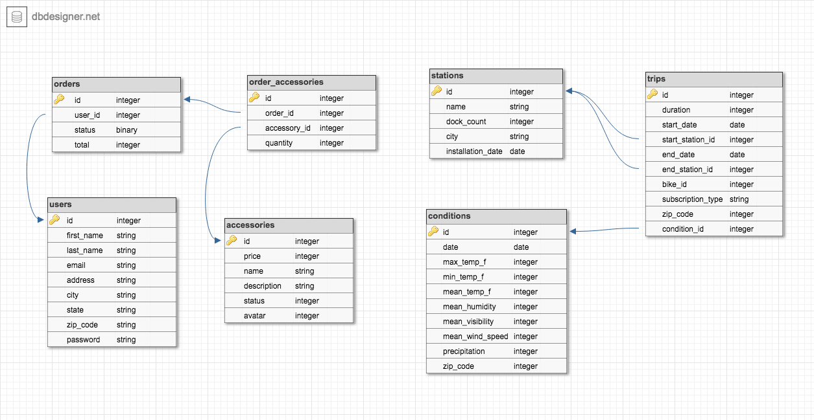

# Alchemists Cyclery

Deployed on Heroku: [Alchemists Cyclery](http://alchemists-cyclery.herokuapp.com/)

This is an application which is designed to analyze the San Francisco bike share database and provide a platform for an online bike-accessory shop. The application is built in Ruby/Rails using a postgresql database and paperclip for image handling. A group project completed over a two week period, this project allowed us to use an Agile workfow, leveraging on Waffle.io

Things you may want to cover:

## Setup

To run this application locally, please clone this repo and follow the steps below:

`$ bundle`

`$ rake db:create db:migrate db:seed`

The seed process will take a good amount of time, so be patient!

## Server Start-up

After completing the steps above, start up your local server:

`$ rails s`

Navigate to the local port indicated (most likely localhost:3000)

## Run the Test Suite

To run the full test suite:

`$ rspec`

To run only a portion of the test suite:

`$rspec spec/file-path`

## Schema

## Additional Resources

For more information about the tools used in this process, please visit the links below:

* Paperclip - https://github.com/thoughtbot/paperclip
* Heroku - https://devcenter.heroku.com/articles/getting-started-with-rails5
